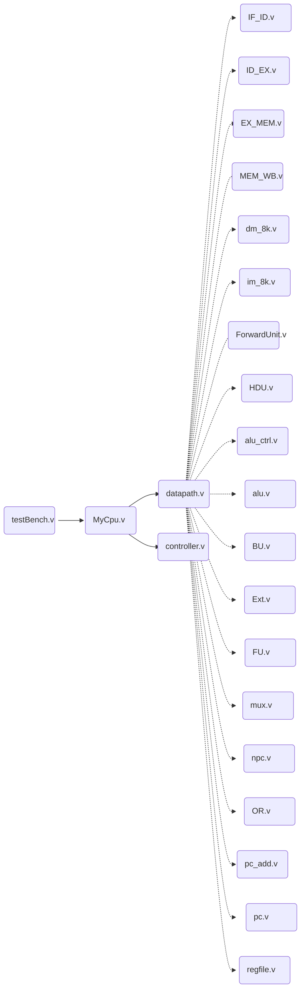

[toc]

# 计算机组成原理实验报告——带转发和冒险的五级流水线CPU的实现

> 姓名：黄哲龙
>
> 学号：161910227
>
> 班级：1619001
>
> 专业：人工智能创新班
>
> 完成时间：2021.6.1

---

## 项目构建

本项目使用轻量级方案：iverilog+gtkwave构建，项目地址为：[LSTM-Kirgaya的仓库](https://github.com/LSTM-Kirigaya/ComputerDesignExperiment/tree/main/multistage_pipeline_final)。

### 项目结构

项目结构如下：

```
multistage_pipeline
	|-> data:		 	IM和DM读入的地方
	|-> figure:      	设计图纸，我高兴时可能会写写使用说明
	|-> Python:		 	一些加速生产的脚本
	|-> mips_code:   	用来测试的mips汇编源代码
	|-> sim:		    放激励文件的文件夹
	|-> src
		|-> Controller: 控制器
		|-> DataPath:   数据通路
		|-> Hazard:		旁路模块与冒险检测模块
		|-> Pipe:		流水线寄存器
		|-> Utils:		其余组件
		|-> myCpu.v:	顶层模块
	
	|-> README.md:   	Current 
	|-> .gitignore		上传文件过滤列表
```

在clone我的项目后，根据你的操作系统的不同，可在本地直接运行sim文件夹下的激励文件来验证FPGA项目。需要说明的是，笔者使用的操作系统为Windows10和Ubuntu18.04。

### Windows

请根据[我在知乎的文章](https://zhuanlan.zhihu.com/p/367612172)，先安装iverilog编译器，gtkwave可视化命令行工具。

在data文件夹下放入指令和数据后，在项目根目录下运行`.\run.bat`：

```
> cd multistage_pipeline_final
> .\run.bat
```

即可完成编译，在sim文件夹下可以获取生成的波形文件。使用以下命令就可通过gtkwave查看波形：

```
> gtkwave .\sim\wave.vcd
```

windows下的gtkwave软件效果如下：


### Linux

Linux下先安装iverilog套组，安装命令如下：

```
$ sudo apt-get install iverilog
$ sudo apt-get install gtkwave
```

在安装完后运行进入项目运行脚本文件即可：

```
$ cd multistage_pipeline_final
$ sh .\run.sh
```

即可获得和windows下相同的效果。

查看波形图的做法也类似，不过需要多加一个`-f`参数：

```
$ gtkwave -f .\sim\wave.vcd
```

windows下的gtkwave软件效果如下：


### MacOS

同Linux下一样，使用brew包管理工具下载iverilog和gtkwave，然后仿照run.sh编写脚本文件，再运行之即可。

---


## 功能设计说明

本次实验实现的为带转发和冒险的五级流水线，实现了原本要求的57条指令，其中三条特权指令和两条自陷指令的控制信号与所需要的异常信号接口已经完成，但是由于实验中并无要求实现协处理器，且还未模拟操作系统处理异常的异常处理地址上的代码，故这三条特权指令并未完全实现。所有指令如下：

| 指令功能类型 | 包含指令                                                     |
| ------------ | ------------------------------------------------------------ |
| 算数运算指令 | `add,addi,addu,addiu`,`sub,subu`,`slt,slti,sltu,sltiu`,`mult,multu`,`div,divu` |
| 逻辑运算指令 | `and,andi`,`or,ori`,`lui`,`nor`,`xor,xori`                   |
| 移位指令     | `sll,sllv`,`srl,srlv`,`sra,srav`                             |
| 分支跳转指令 | `beq,bne`,`bgez,bgtz,blez,bltz,bgezal,bltzal`,`j,jr,jal,jalr` |
| 数据移动指令 | `mfhi,mflo`,`mthi,mtlo`                                      |
| 自陷指令     | `break`,`syscall`                                            |
| 访存指令     | `lb,lbu,lh,lhu,lw`,`sb,sh,sw`                                |
| 特权指令     | `eret`,`mfc0,mtc0`                                           |

为了使得数据通路可是支持所有的57条指令且能够完成各阶段的旁路、冒险、转发，我以书上的单周期为蓝本，其余部分全部自行设计，在经过若干次迭代调整后，最终通过既定测试汇编的全套MIPS指令的CPU的RTL级设计图纸如下：


---

## 模块化与层次设计

在组织项目方面，为了模块化设计。项目采用多文件组织的方法，各文件的调用关系如下：



可以看到，我们的激励文件`testBench.v`是项目的顶层文件，而整个CPU内部的所有活动可以看成是数据通路`datapath.v`和`contoller.v`的交互。

---

## 模块定义

下面将介绍CPU中的各个模块，介于部分模块功能重复，所以并不会事无巨细地介绍完所有的模块。

### alu.v

#### (1) 基本描述

EX阶段核心部件，用于对输入的源操作数和位移量进行计算，是CPU的计算单元。根据指令职能的不同，alu的目的可以分为两种：

1. 实现算术类指令 
2. 计算存取指令的目的地址。

与书本不同，我的alu增加了一个输出接口：`prod`。这个`prod`的定义和功能我在**研发日志2021.5.18**中描述过了：

> 在实现乘除法指令(`MULT,DIV,MULTU,DIVU`)时，我发现了一个问题，那就是乘除法指令的输出是一个63位的数字，虽然实际上乘除法只是改变专用寄存器的值，但是我对专用寄存器的设计使得我每个时钟周期只能改变`$hi`和`$lo`中的某一个。我的电路无法在一个时钟周期内一次性改变`$hi`和`$lo`。总得满足我的乘除法指令吧？怎么办呢？我的做法比较简单粗暴，我为`ALU`增加了一个输出接口`prod`，这个接口值和MIPS32指令手册上描述乘法除法中的prod的含义一样，为了让它能够成功抵达`regfile`，并成功写入，我做出了如下的改变：
>
> - `ALU`增加新的输出接口值`prod`，当然，相应的后续流水线寄存器中也会添加暂存prod的接口。
> - 选择目的操作数寄存器编号的`mux1`增加一个选项：34，不同于0-33，34不代表任何一个寄存器的编号，而是告诉我们的regfile，你要拆分并读入流水线存入的prod值。
> - `regfile`增加一个输入接口`MEM_WB_prod`，代表接受最后一个流水线寄存器的存储的prod值。然后在`regfile`内部，我增加了写寄存器的逻辑：增加一个34号，如果接受到的目的操作数编号（在我的设计中为`MEM_WB_mux1_out`）为34，则将prod拆成两块送给`$hi`和`$lo`。

#### (2) 模块接口

| 信号名 |  接口类型  | 接口位数 |  描述  |
| ---- | ---- | ---- | ---- |
| `clock` | input | [0] | 全局时钟信号，用来控制时序部件 |
| `reset` | input | [0] | 全局时钟信号，用来激活部分模块的初始化行为 |
| `alu_ctrl_out` | input | [ 4: 0] | `alu_ctrl`的输出，用来定义`alu`对输入的`op1`,`op2`和`shamt`进行的操作逻辑 |
| `op1` | input | [31: 0] | 第一个操作数 |
| `op2` | input | [31: 0] | 第二个操作数 |
| `shamt` | input | [ 4: 0] | 偏移量，如果是位移类型指令，都会使用 |
| `alu_out` | output | [31: 0] | alu的输出 |
| `prod` | output | [63: 0] | 乘除法的结果 |
| `overflow` | output | [0] | 检测当前有符号运算是否溢出的标识符 |
| `divideZero` | output | [0] | 检测当前除法运算的分母是否为0的标识符 |

#### (3) 细节说明

- 在实现`sll`和`sllv`这两类指令时，虽然`sll`是使用`shamt`作为位移量，而`sllv`则是使用`GPR[rs]`作为位移量，但是在alu中，我都使用形如`op2>>shamt`来实现逻辑位移或者算术位移，之所以能这么做，是因为我在`mux11`这个模块中区分了`shamt`的由来是原本的shamt还是`GPR[rs]`。详细可见mux11。

- 由两个特殊的R型指令`MTHI`和`MTLO`，这两个指令只负责数据的传输，在具体做的时候，直接将第一个操作数赋值给`alu_out`就行了，代码如下：

  ```verilog
  MTHI_OP : begin
      alu_out = op1;
      overflow = 0;
      divideZero = 0;
  end
  ```


### alu_ctrl.v

#### (1) 基本描述

alu_ctrl将会将会根据得到的当前指令的`ALUOp`和`funct`码确定当前周期对应的指令在alu中的操作行为，由于在alu中，我定义了20个基础操作，所有的指令的运算都可以归结到这20个基础的操作。所以我的alu_ctrl的输出端口`alu_ctrl_out`的宽度为5. 因此，alu_ctrl_out就做了一件事——将R类指令和非R类指令的指令映射到其对应的alu中操作行为的信号。

在这样的认知下，我们应该对alu_ctrl有另一个角度的认识——确定`alu_ctrl_out`的值也就是确定目前指令对应到alu中的具体的操作行为。

> `ALUOp`，`funct`和`alu_ctrl_out`的信号域请见报告末附录的**信号域**表格。后续不在介绍中写信号域了。

#### (2) 模块接口

| 信号名 |  接口类型  | 接口位数 |  描述  |
| ---- | ---- | ---- | ---- |
| `ID_EX_ALUOp` | input | [ 3: 0] | 用于区分R类指令和非R类指令；用于将非R类指令映射到其对应的alu操作行为 |
| `ID_EX_instr26` | input | [25: 0] | 取其后五位也就是当前指令代表的`funct`码，用于将R类指令映射到其对应的alu操作行为 |
| `alu_ctrl_out` | output | [ 4: 0] | `alu_ctrl`的输出，用于控制alu。其取值将决定alu对输入的操作行为 |

#### (3) 细节说明

- 在输入接口上，之所以使用`ID_EX_instr26`而不是`ID_EX_funct`是因为在总的数据通路上，没有`ID_EX_funct`这个信号，但是有`ID_EX_instr26`这个信号。而项目中，我使用了代码生成脚本，这样可以极快加快开发速度，不过就要求使用的接口需要尽可能在调用模块中出现。而在后续的许多模块中，也会出现类似的状况，不再赘述。
- 对于R类指令和非R类指令的映射对象不同，对于R类指令，它们的`ALUOp`都是`4'b0000`，因此，我们将根据`funct`码来确定`alu_ctrl_out`的值；而对于非R类指令，则会根据`ALUOp`来确定`alu_ctrl_out`的值。


### BU.v

#### (1) 基本描述

BU模块是branch unit的缩写（自创），它的作用在于根据输入的两个操作数`mux8_out`与`mux9_out`和`Branch`信号（请见Branch的信号域Branch field）来确定本次指令是否要执行跳转。在Branch的信号域中你可以看到，一共有9种不同的branch类型指令，所以需要Branch信号需要一个4位信号表示。

#### (2) 模块接口

| 信号名 |  接口类型  | 接口位数 |  描述  |
| ---- | ---- | ---- | ---- |
| `Branch` | input | [ 3: 0] | 共代表9种不同类型的跳转 |
| `mux8_out` | input | [31: 0] | 第一个操作数 |
| `mux9_out` | input | [31: 0] | 第二个操作数 |
| `BU_out` | output | [0] | BU模块的输出，1代表要跳转，否则不跳转 |

#### (3) 细节说明

- 在进行小于比较或者大于比较时需要先对比较的两个数进行有符号转换，否则负数永远比正数大，电路就会发生逻辑错误。在verilog中，直接高位补充最高位或者使用`$signed()`系统指令就可以完成对一个数字的有符号转换。
- `mux8_out`和`mux9_out`并不是直接从寄存器堆中读取的数据，而是经过了`Forward Unit1`旁路过的数值。


### Ext.v

#### (1) 基本描述

用于将指令后16位，也就是I型指令的16位立即数扩展成32位，其收到一个信号`Ext_op`的控制，来控制其扩展方式是有符号数还是无符号数。需要说明的是，Ext模块拓展得到的数会在两个地方使用到：

1. 用于计算branch类指令的跳转位移
2. 用于I指令的第二个源操作数


#### (2) 模块接口

| 信号名 |  接口类型  | 接口位数 |  描述  |
| ---- | ---- | ---- | ---- |
| `Ext_op` | input | [0] | 拓展信号，1为有符号拓展，0为无符号拓展 |
| `IF_ID_im_out` | input | [31: 0] | 当前的32位指令，我们会切取其中的后16位从而获得I类指令的16位立即数 |
| `Ext_out` | output | [31: 0] | Ext拓展成32位的输出 |

#### (3) 细节说明

- 有符号拓展为高位补最高位，无符号拓展位高位补0，实现代码如下：

  ```verilog
  always @(*) begin
      if (Ext_op)
          Ext_out = {{16{IF_ID_im_out[15]}}, IF_ID_im_out[15: 0]};
      else 
          Ext_out = {{16{1'b0}}, IF_ID_im_out[15: 0]};
  end
  ```

  

### FU.v

#### (1) 基本描述

FU是Flush unit的简称，也就是冲刷模块，它负责判断本次指令是否需要冲刷`IF_ID`流水线寄存器中的值。

#### (2) 模块接口

| 信号名 |  接口类型  | 接口位数 |  描述  |
| ---- | ---- | ---- | ---- |
| `BU_out` | input | [0] | BU模块的输入，代表是否要跳转 |
| `Jump` | input | [0] | 控制器的Jump信号，代表是否要执行J类指令 |
| `Jr` | input | [0] | 控制器的Jr信号，代表本次是否需要执行Jr指令 |
| `Skip_IF_Flush` | output | [0] | 输出值，代表是否要冲刷`IF_ID`流水线寄存器 |

#### (3) 细节说明

- `FU`的实现很简单，只要输入的三个信号有一个为1，也就是即将发生跳转行为，那么就发生冲刷，所以直接将输出的三个信号做或运算就是输出值了。

- 需要说明的，本次实验使用的是延迟槽技术，里面存在一个小bug使得即便`Skip_IF_Flush=1`，`IF_ID`寄存器也不一定会被冲刷。在我的**研发日志2021.5.31**中记载了相关问题：

  > 对于跳转指令的堵塞，有一个很隐蔽的bug，在控制冒险时，当我们为了branch指令的操作数而软阻塞ID阶段和IF阶段的指令时，由于使用的是延迟槽的机制，虽然我们阻塞了ID和IF，但是判断是否冲刷的模块还是在正常工作。所以如果堵塞的branch指令是生效，是需要跳转的，那么在堵塞的第一个周期，IF_ID流水线寄存器中保存的ID阶段的指令就会被冲刷成空指令，这会使得第二个堵塞周期结束，电路回归正常时，branch会去解析空指令，从而使得pc变成0（这根据你提供的空指令的后16位决定，我使用的是`addi $t0, $zero, 0`，其后16位为0）.所以有必要控制堵塞IF_ID流水线寄存器的信号和冲刷IF_ID流水线寄存器的信号的优先级：**当且仅当IF_ID流水线寄存器不被堵塞时，IF_ID才能执行冲刷的操作**。

  更改的代码请见文末的研发日志**2021.5.31**
  
  

### mux.v

整个电路中暴露在模块外的多路选择器都在`mux.v`中得到了实现。每个作用都不一样，下面将一一介绍：

#### mux1

##### (1) 基本描述

1号多路选择器负责输出当前指令最终的目的操作数，也就是告诉后面的`regfile`到底是哪个寄存器会被改写。


##### (2) 模块接口

| 信号名 |  接口类型  | 接口位数 |  描述  |
| ---- | ---- | ---- | ---- |
| `ID_EX_RegDst` | input | [ 2: 0] | 控制多路选择器选择哪个数字作为最终的目的操作数 |
| `ID_EX_instr26` | input | [25: 0] | 从中获取`rt`和`rd`的值 |
| `mux1_out` | output | [ 5: 0] | 输出最终的目的操作数 |

##### (3) 细节说明

- 这个模块是我整合了所有需要写寄存器的指令后得到的结果，我将原先只是选择`rd`和`rt`的双路选择器的职能扩展了，使得所有需要写寄存器的指令都可以统一操作获取它们的目的操作数。比如我们有一些指令需要往专用寄存器`$hi`中写，那么我们就可以在控制器中将它对应的`RegDst`设为`3'b011`（详细请移步`RegDst`的信号域），然后`mux1`就会选择`3'b011`对应的输入，也就是常数32(十进制)，在写回`regfile`时，`regfile`会首先判断层层传过来的`mux1`的输出是不是34，因为只有34号是对应两个寄存器被改写，其他的数字正好就是其对应的regfile中的寄存器编号。

#### mux2 & mux3

##### (1) 基本描述

`mux2`和`mux3`合在一起讲，因为它们的功能完全相同，他们都是对alu的输入源操作数的旁路系统中的最后的多路选择器，作用在于根据旁路单元的输入信号决定从哪条线拿到最新的源操作数。

##### (2) 模块接口(mux2举例)

| 信号名 |  接口类型  | 接口位数 |  描述  |
| ---- | ---- | ---- | ---- |
| `Forward2A` | input | [ 1: 0] | 旁路单元输出的控制信号 |
| `ID_EX_mux8_out` | input | [31: 0] | 原本的源操作数 |
| `mux6_out` | input | [31: 0] | `WB`阶段的数值 |
| `EX_MEM_mux5_out` | input | [31: 0] | `MEM`阶段的数值 |
| `mux2_out` | output | [31: 0] | 选择器的输出，代表最新的操作数 |

##### (3) 细节说明

- 需要注意源操作数值选择的优先级，如果`MEM`和`WB`节点的目的操作数和当前的源操作数都相同，那么一定是优先选择`MEM`阶段的操作数，因为`MEM`阶段得到的值更新。

#### mux4

##### (1) 基本描述

用于选择使用第二个操作数`GPR[rt]`还是立即数。

##### (2) 模块接口

| 信号名 |  接口类型  | 接口位数 |  描述  |
| ---- | ---- | ---- | ---- |
| `ID_EX_ALUSrc` | input | [0] | 控制信号，1选择立即数，0选择`GPR[rt]` |
| `ID_EX_Ext_out` | input | [31: 0] | 立即数 |
| `mux3_out` | input | [31: 0] | 旁路后的`GPR[rt]` |
| `mux4_out` | output | [31: 0] | 输出alu输入的第二个操作数 |

##### (3) 细节说明

- 这个与单周期中判断使源操作数还是立即数的那个多路选择器一样。不同点在于它输入的源操作数时旁路后的值。

#### mux5

##### (1) 基本描述

用于判断最终送入寄存器堆的数值，比如我们一条指令要写寄存器堆，可以表示为`GPR[x]=data`，其中的`x`是由`mux1`决定的，那么`data`就是由`mux5`决定的。因为并不是每个要写回寄存器的指令都是以alu的输出作为`data`的，比如`jal`指令，需要用当前的`pc+4`写入`$ra`中；比如`mfhi`和`mflo`指令，需要将专用寄存器中的值输写入`GPR[x]`中，因此需要在`mux5`中判断。

##### (2) 模块接口

| 信号名 |  接口类型  | 接口位数 |  描述  |
| ---- | ---- | ---- | ---- |
| `ID_EX_DataDst` | input | [ 2: 0] | 控制信号，判断`pc+4`，旁路后的专用寄存器值和alu结果哪个将输出 |
| `mux11_out` | input | [31: 0] | 被旁路后的`$lo`寄存器中的值 |
| `mux12_out` | input | [31: 0] | 被旁路后的`$hi`寄存器中的值 |
| `ID_EX_pc_add_out` | input | [31: 0] | 本次指令的`pc+4` |
| `alu_out` | input | [31: 0] | alu的计算结果 |
| `mux5_out` | output | [31: 0] | 选择器的输出，代表最终写入寄存器中的值 |

##### (3) 细节说明

- 这个模块可以和`mux1`遥相呼应，职能和`mux1`基本对称，需要注意的是，为了获取专用寄存器中的值，`$lo`和`$hi`的值通过硬布线连接到了EX阶段，为了防止数据延迟，我还为硬布线过来的专用寄存器值进行了旁路，细节将在3号旁路单元讲到。

#### mux6

##### (1) 基本描述

用来判断最终到底是`EX`阶段得到的数被写入寄存器堆还是`MEM`节点读取的数字被写入寄存器堆。

##### (2) 模块接口

| 信号名 |  接口类型  | 接口位数 |  描述  |
| ---- | ---- | ---- | ---- |
| `MEM_WB_MemtoReg` | input | [0] | 控制信号，为1选择`MEM`阶段读取的数，为0选择`EX`阶段的数 |
| `MEM_WB_dm_out` | input | [31: 0] | `MEM`阶段获取的数 |
| `MEM_WB_mux5_out` | input | [31: 0] | `EX`阶段获取的数 |
| `mux6_out` | output | [31: 0] | 选择器输出的值 |

##### (3) 细节说明

- 与单周期的对应位置的多路选择器一样。

#### mux7

##### (1) 基本描述

用于判断是否需要将`ID`阶段解码获取的控制器信号全部清零，以达到使得软堵塞时顺延到`EX`阶段的指令不会堆硬件造成影响。

##### (2) 模块接口

| 信号名 |  接口类型  | 接口位数 |  描述  |
| ---- | ---- | ---- | ---- |
| `OR3_out` | input | [0] | 控制信号，为1表示要清零，为0表示不要清零 |
| `LS_bit` | input | [ 1: 0] | 见controller.v |
| `RegDst` | input | [ 2: 0] | 见controller.v |
| `DataDst` | input | [ 2: 0] | 见controller.v |
| `MemtoReg` | input | [0] | 见controller.v |
| `ALUOp` | input | [ 3: 0] | 见controller.v |
| `MemWrite` | input | [0] | 见controller.v |
| `ALUSrc` | input | [0] | 见controller.v |
| `ShamtSrc` | input | [0] | 见controller.v |
| `RegWrite` | input | [0] | 见controller.v |
| `Ext_op` | input | [0] | 见controller.v |
| `ExcCode` | input | [ 3: 0] | 见controller.v |
| `mux7_LS_bit` | output | [ 1: 0] | 对应的controller信号 |
| `mux7_RegDst` | output | [ 2: 0] | 对应的controller信号 |
| `mux7_DataDst` | output | [ 2: 0] | 对应的controller信号 |
| `mux7_MemtoReg` | output | [0] | 对应的controller信号 |
| `mux7_ALUOp` | output | [ 3: 0] | 对应的controller信号 |
| `mux7_MemWrite` | output | [0] | 对应的controller信号 |
| `mux7_ALUSrc` | output | [0] | 对应的controller信号 |
| `mux7_ShamtSrc` | output | [0] | 对应的controller信号 |
| `mux7_RegWrite` | output | [0] | 对应的controller信号 |
| `mux7_Ext_op` | output | [0] | 对应的controller信号 |
| `mux7_ExcCode` | output | [ 3: 0] | 对应的controller信号 |

##### (3) 细节说明

- 在实现时，如果真的发生软堵塞，并不需要将所有的信号都清零，只需要将会对硬件造成影响的信号清零就行了，这些信号包括`RegWrite`和`MemWrite`。


#### mux8 & mux9

##### (1) 基本描述

用于旁路的多选器，旁路的对象为`ID`阶段的数，因为`ID`阶段的branch类型指令需要最新的源操作数来比较，所以需要旁路。

##### (2) 模块接口(mux8)

| 信号名 |  接口类型  | 接口位数 |  描述  |
| ---- | ---- | ---- | ---- |
| `Forward1A` | input | [ 1: 0] | 旁路控制信号 |
| `regfile_out1` | input | [31: 0] | 寄存器堆的第一个输出位，也就是当前的`GPR[rs]` |
| `EX_MEM_mux5_out` | input | [31: 0] | `MEM`阶段的数值 |
| `mux6_out` | input | [31: 0] | `WB`阶段的数值 |
| `mux8_out` | output | [31: 0] | 输出，代表`ID`阶段最新的`GPR[rs]` |

##### (3) 细节说明

- 常规的旁路系统的多路选择器，其大致结构和`EX阶段的差不多。

#### mux10

##### (1) 基本描述

用于筛选偏移量的选择器，`sll`和`sllv`的区别就体现在这个双路选择器上。

##### (2) 模块接口

| 信号名 |  接口类型  | 接口位数 |  描述  |
| ---- | ---- | ---- | ---- |
| `ShamtSrc` | input | [0] | 控制信号，为1选择`GPR[rs]`为偏移量，为0选择原本的`shamt`为偏移量 |
| `ID_EX_instr26` | input | [25: 0] | 从中切分出`shamt` |
| `mux2_out` | input | [ 4: 0] | 旁路后的`GPR[rs]` |
| `mux10_out` | output | [ 4: 0] | 输出真正的偏移量 |

##### (3) 细节说明

- 事实上，这个多路选择器完全可以合并进入alu中，但是为了alu结构的纯净，我还是选择了将多路选择器放在了alu外面。


#### mux11 & mux12

##### (1) 基本描述

用于旁路专用寄存器值的旁路系统的多路选择器。

##### (2) 模块接口(mux11)

| 信号名 |  接口类型  | 接口位数 |  描述  |
| ---- | ---- | ---- | ---- |
| `Forward3A` | input | [ 2: 0] | 旁路控制信号，具体选择逻辑可见图纸 |
| `ID_EX_low_out` | input | [31: 0] | 原来的`$lo`寄存器中的值 |
| `EX_MEM_mux5_out` | input | [31: 0] | `MEM`阶段要写入寄存器的值 |
| `MEM_WB_mux5_out` | input | [31: 0] | `WB`阶段要写入寄存器的值 |
| `EX_MEM_prod` | input | [63: 0] | `MEM`阶段的`prod` |
| `MEM_WB_prod` | input | [63: 0] | `WB`阶段的`prod` |
| `mux11_out` | output | [31: 0] | 输出当前最新的`$lo`寄存器的值 |

##### (3) 细节说明

- 具体选择的逻辑如下表所示

| 旁路单元的控制信号 | 选择的值 |
| ---- | ---- |
| 3'b100 | `EX_MEM_prod` |
| 3'b011 | `MEM_WB_prod` |
| 3'b010 | `EX_MEM_alu_out` |
| 3'b001 | `MEM_WB_alu_out` |
| 3'b000 | `ID_EX_low_out` |

- 与之前的旁路选择器相比，`mux11/12`的输入明显增多，这是因为后续的信号中，专用寄存器既有可能存在于`mux5`的输出，也有可能存在于`prod`中。


### npc.v

#### (1) 基本描述

计算出下一个阶段pc值得模块，主要用于判断是顺序执行，branch跳转执行，J类跳转执行，还是Jr跳转执行。

#### (2) 模块接口

| 信号名 |  接口类型  | 接口位数 |  描述  |
| ---- | ---- | ---- | ---- |
| `Jr` | input | [0] | `Jr`控制信号，为1执行`Jr`跳转 |
| `Jump` | input | [0] | `Jump`控制信号，为1执行`Jump`跳转 |
| `BU_out` | input | [0] | `BU_out`控制信号，为1执行`Branch`跳转 |
| `pc_add_out` | input | [31: 0] | pc+4 |
| `IF_ID_im_out` | input | [31: 0] | 截取获得jump需要得跳转地址 |
| `Ext_out` | input | [31: 0] | 跳转指令需要的相对位移大小 |
| `mux8_out` | input | [31: 0] | `GPR[rs]`的值，Jr指令的跳转地址 |
| `npc_out` | output | [31: 0] | 下一位的输出 |

#### (3) 细节说明

- 具体实现时，`Jr`，`Jump`和`BU_out`中最多只会有一个为1，那么为1的那位输出其对应的地址，否则输出`pc_add_out`

- 有关branch的跳转需要减4，具体理由可见**研究日志2021.5.31**：

  > **第二个值得记载的bug**就是有关branch类型指令的问题，在pro1和pro2中的branch信号中，我最终的目标地址是通过branch当前的相对位移`>>2`和基地址相加得到的，但是pro3在我的设计中，branch在ID阶段得到的`pc_add_out`是当前IF阶段的`pc_add_out`，而不是随着当前这条branch指令得到的。因此在使用branch跳转时使用的`pc_add_out`必须减四才能正确。

### OR.v

#### (1) 基本描述

用于几个软堵塞信号进行融合，由于作用类似，只说明`OR1`。

#### (2) 模块接口(OR1)

| 信号名 |  接口类型  | 接口位数 |  描述  |
| ---- | ---- | ---- | ---- |
| `PcStall1` | input | [0] | 转发冒险检测模块输出的堵塞信号 |
| `PcStall2` | input | [0] | 数据冒险检测模块输出的堵塞信号 |
| `OR1_out` | output | [0] | 输出信号来决定PC是否要停止更新 |

#### (3) 细节说明

- 实现逻辑很简单，只要有一个信号表明要堵塞，那么就需要堵塞，所以只需要将所输出的数值做或运算即可。


### pc.v

#### (1) 基本描述

用于更新本次pc的模块。

#### (2) 模块接口

| 信号名 |  接口类型  | 接口位数 |  描述  |
| ---- | ---- | ---- | ---- |
| `clock` | input | [0] | 全局时钟信号，用来控制时序部件 |
| `reset` | input | [0] | 全局时钟信号，用来激活部分部件的初始化行为 |
| `npc_out` | input | [31: 0] | `npc`的输出 |
| `OR1_out` | input | [0] | 是否要堵塞的信号 |
| `pc_out` | output | [31: 0] | 本次取码的pc地址 |

#### (3) 细节说明

- 与之前的pc完全相同，在初始化有一个bug，具体见**研究日志2021.5.30**：

  > 开始进行整体测试，今天先测试所有的R型指令，遇到了pc启动的问题，我将reset设置为了上升沿，并且将`pc.v`修改如下：
  >
  > ```verilog
  >     // initial 
  >     always @(posedge reset) begin
  >         pc_out <= initial_addr;
  >     end
  > 
  >     always @(posedge clock && reset == 1) begin
  >         if (!OR1_out)              // OR1_out represents stall or not
  >             pc_out <= npc_out;
  >     end
  > ```
  >
  > 也就是将初始化和持续更新分开来。
  >
  > 除此之外，用来用来软堵塞pc的`OR1_out`和`OR2_out`一开始都是x，会使得pc在启动时不更新，所以需要对两个冒险模块初始化其输出信号，使得一开始输出的都是不堵塞的信号。


### pc_add.v

#### (1) 基本描述

用于将获得的pc加4。

#### (2) 模块接口

| 信号名 |  接口类型  | 接口位数 |  描述  |
| ---- | ---- | ---- | ---- |
| `pc_out` | input | [31: 0] | pc的输出 |
| `pc_add_out` | output | [31: 0] | pc+4 |


### regfile.v

#### (1) 基本描述

寄存器堆，取寄存器和写寄存器的逻辑定义其中。其实同时存在于`ID`和`WB`两个阶段中。

#### (2) 模块接口

| 信号名 |  接口类型  | 接口位数 |  描述  |
| ---- | ---- | ---- | ---- |
| `clock` | input | [0] | 全局时钟信号，用来控制时序部件 |
| `reset` | input | [0] | 全局时钟信号，用来激活部分部件的初始化行为 |
| `MEM_WB_RegWrite` | input | [0] | `WB`阶段记载的`RegWrite`，为1时才会发生写寄存器的行为 |
| `rs` | input | [ 4: 0] | `rs` |
| `rt` | input | [ 4: 0] | `rt` |
| `MEM_WB_mux1_out` | input | [ 5: 0] | 目的操作数，也就是指定被改写的寄存器编号 |
| `mux6_out` | input | [31: 0] | 写入寄存器的数值 |
| `MEM_WB_prod` | input | [63: 0] | 有关乘除法的结果 |
| `low_out` | output | [31: 0] | 输出`$lo`中的值 |
| `high_out` | output | [31: 0] | 输出`$hi`中的值 |
| `regfile_out1` | output | [31: 0] | `GPR[rs]`的值 |
| `regfile_out2` | output | [31: 0] | `GPR[rt]`的值 |

#### (3) 细节说明

- 为了防止新的写入的数和取数不发生矛盾，我们需要保证取数在写入数之后，这样就可以保证得到的数尽可能是最新的。为了达到这个目的，我让`regfile`在`clock`的上升沿写入，在`clock`的下降沿取数，那么就能保证写入在取数之前。

- 其中的目的操作数的位数不是原本的5位，因为需要考虑到专用用寄存器的存取，因此，需要有6位，而且为了满足乘除操作在一个时钟周期同时改写两个寄存器的特点，我们需要特判`MEM_WB_mux1_out`，如果它为34，那么就需要将`prod`拆成两块给两个专用寄存器。实现代码如下：

  ```verilog
  module regfile (
      input              clock,
      input              reset,
      input              MEM_WB_RegWrite,
      input      [ 4: 0] rs,
      input      [ 4: 0] rt,                    
      input      [ 5: 0] MEM_WB_mux1_out, // rd      
      input      [31: 0] mux6_out,        // data
      input      [63: 0] MEM_WB_prod,     // prod               
      output reg [31: 0] low_out,
      output reg [31: 0] high_out,
      output reg [31: 0] regfile_out1,
      output reg [31: 0] regfile_out2
  );
      /*
          0~31 : general registers
          32   : $hi
          33   : $lo
      */
  
      reg    [31: 0] registers[34: 0];
      integer        i;
      
      // load data from regfile
      always @(negedge clock) begin           // we should load data in the latter half of the cycle in order to let update appear first
          // half of the cycle
          high_out     = registers[32];
          low_out      = registers[33];
          regfile_out1 = (rs == 0) ? 0 : registers[rs];
          regfile_out2 = (rt == 0) ? 0 : registers[rt];
      end
      
      always @(posedge reset) begin
          for (i = 0; i < 34; i = i + 1)
              registers[i] = 0;
      end
  
      // Write mux6_out to regfile
      always @(posedge clock) begin
          if (MEM_WB_RegWrite && MEM_WB_mux1_out != 0)
          begin
              if (MEM_WB_mux1_out == 34)           // result of mult of div
              begin
                  registers[32] = MEM_WB_prod[63:32];     // high
                  registers[33] = MEM_WB_prod[31: 0];     // low
              end
              else  
                  registers[MEM_WB_mux1_out] = mux6_out;
          end            
      end
      
  endmodule //regfile
  ```

  

### IF_ID.v

#### (1) 基本描述

由于流水线寄存器的功能都是暂存该阶段的状态，所以此处只介绍最特殊的`IF_ID`流水线寄存器。

#### (2) 模块接口

| 信号名 |  接口类型  | 接口位数 |  描述  |
| ---- | ---- | ---- | ---- |
| `clock` | input | [0] | 全局时钟信号，用来控制时序部件 |
| `reset` | input | [0] | 全局时钟信号，用来激活部分部件的初始化行为 |
| `OR2_out` | input | [0] | 控制堵塞的信号，为1堵塞 |
| `OR4_out` | input | [0] | 控制冲刷的信号，为1冲刷 |
| `pc_add_out` | input | [31: 0] | pc+4 |
| `im_out` | input | [31: 0] | instruction的输出 |
| `IF_ID_pc_add_out` | output | [31: 0] | 暂存的pc+4 |
| `IF_ID_im_out` | output | [31: 0] | 暂存的instruction的输出 |

#### (3) 细节说明

- 这个流水线寄存器是所有的流水线寄存器中唯一一个收到非clock信号控制的，这么做是为了配合pc形成软堵塞。
- 对于其中的更新机制，在之前提到的**研究日志2021.5.31**中有所提及，也就是关于`OR2_out`和`OR4_out`的优先级。只有当`OR2_out`为0时，`OR4_out`才有可能生效，也就说冲刷的前提条件是当前没有堵塞。关于堵塞时还发生冲刷的后果在**研究日志2021.5.31**中有所提及。


### ForwardUnit.v

#### (1) 基本描述

旁路单元，用于解决具有相关性的指令相邻执行的问题，由于旁路的逻辑都差不多，此处只展示1号旁路单元的接口，但是我会介绍所有的旁路单元选择旁路的条件。

#### (2) 模块接口(ForwardUnit1)

| 信号名 |  接口类型  | 接口位数 |  描述  |
| ---- | ---- | ---- | ---- |
| `rs` | input | [ 4: 0] | `rs`，也就是指令的25到21位 |
| `rt` | input | [ 4: 0] | `rt`，也就是指令的20到16位 |
| `EX_MEM_RegWrite` | input | [0] | `MEM`阶段的`RegWrite` |
| `EX_MEM_mux1_out` | input | [ 5: 0] | `MEM`阶段的目的操作数 |
| `MEM_WB_RegWrite` | input | [0] | `WB`阶段的`RegWrite` |
| `MEM_WB_mux1_out` | input | [ 5: 0] | `WB`阶段的目的操作数 |
| `Forward1A` | output | [ 1: 0] | 向第一个源操作数的多路选择器发送的控制信号 |
| `Forward1B` | output | [ 1: 0] | 向第二个源操作数的多路选择器发送的控制信号 |

#### (3) 细节说明

- 此处将大致说明旁路的逻辑，什么时候旁路，谁会旁路过来。首先需要说明的一点为，旁路的原则是选取最新的操作数，因此最好使用`if...else if...else`这样串行执行的分支选择语句，而不是`case`这样的平行执行的分支选择语句。

- 对于`ForwardUnit1`来说，旁路条件和结果为：（以旁路`rs`的值为例）
  $$
  \begin{align}
  &\text{if (MEM阶段允许写入寄存器}\land\text{MEM阶段的目的操作数不是0}\land\text{MEM阶段的目的操作数等于ID阶段的rs}\text{)} 	\\
  &\quad\quad旁路多路选择器输出 \Leftarrow \text{MEM}阶段的目的写入数\\
  &\text{else if (WB阶段允许写入寄存器}\land\text{WB阶段的目的操作数不是0}\land\text{WB阶段的目的操作数等于ID阶段的源rs}\text{)} 	\\
  &\quad\quad旁路多路选择器输出 \Leftarrow \text{WB}阶段的目的写入数\\
  &\text{else}\\
  &\quad\quad 旁路多路选择器输出 \Leftarrow \text{ID}阶段的写入数\text{GPR[rs]}
  \end{align}
  $$

- 对于`ForwardUnit2`来说，旁路条件和结果为：（以旁路`rs`的值为例）
  $$
  \begin{align}
  &\text{if (MEM阶段允许写入寄存器}\land\text{MEM阶段的目的操作数不是0}\land\text{MEM阶段的目的操作数等于EX阶段的rs}\text{)} 	\\
  &\quad\quad旁路多路选择器输出 \Leftarrow \text{MEM}阶段的目的写入数\\
  &\text{else if (WB阶段允许写入寄存器}\land\text{WB阶段的目的操作数不是0}\land\text{WB阶段的目的操作数等于EX阶段的rs}\text{)} 	\\
  &\quad\quad旁路多路选择器输出 \Leftarrow \text{WB}阶段的目的写入数\\
  &\text{else}\\
  &\quad\quad 旁路多路选择器输出 \Leftarrow \text{EX}阶段的写入数\text{GPR[rs]}
  \end{align}
  $$

- 对于`ForwardUnit3`来说，旁路条件和结果为：（以旁路`$lo`的值为例）
  $$
  \begin{align}
  &\text{if (MEM阶段允许写入寄存器}\land\text{MEM阶段的目的操作数是33}\text{)} 	\\
  &\quad\quad旁路多路选择器输出 \Leftarrow \text{MEM}阶段的目的写入数\\
  &\text{else if (MEM阶段允许写入寄存器}\land\text{MEM阶段的目的操作数是34}\text{)} 	\\
  &\quad\quad旁路多路选择器输出 \Leftarrow \text{MEM}阶段的\text{prod}低32位\\
  &\text{else if (WB阶段允许写入寄存器}\land\text{WB阶段的目的操作数是33}\text{)} 	\\
  &\quad\quad旁路多路选择器输出 \Leftarrow \text{WB}阶段的目的写入数\\
  &\text{else if (WB阶段允许写入寄存器}\land\text{WB阶段的目的操作数是34}\text{)} 	\\
  &\quad\quad旁路多路选择器输出 \Leftarrow \text{WB}阶段的\text{prod}低32位\\
  &\text{else}\\
  &\quad\quad 旁路多路选择器输出 \Leftarrow \text{EX}阶段的\text{\$lo}寄存器的值
  \end{align}
  $$
  

### HDU.v

#### (1) 基本描述

HDU是Hazard Detection Unit的简称，目的在于在旁路单元来不及旁路最新的操作数时让`ID`和`IF`的状态发生软堵塞。需要说明的是，`HDU1`对应`ForwardUnit1`，是用来解决控制冒险的；`HDU2`对应`ForwardUnit2`，是用来解决数据冒险的。

#### (2) 模块接口

##### 1号HDU

| 信号名 |  接口类型  | 接口位数 |  描述  |
| ---- | ---- | ---- | ---- |
| `clock` | input | [0] | 全局时钟信号，用来控制时序部件 |
| `reset` | input | [0] | 全局时钟信号，用来激活部分部件的初始化行为 |
| `use_stage` | input | [0] | 在哪一个阶段使用源操作数，0代表`ID`，1代表`EX` |
| `ID_EX_RegWrite` | input | [0] | `EX`阶段的`RegWrite`信号 |
| `EX_MEM_LS_bit` | input | [ 1: 0] | `MEM`阶段的`LS_bit` |
| `EX_MEM_MemWrite` | input | [0] | `MEM`阶段的`MemWrite` |
| `rs` | input | [ 4: 0] | `rs` |
| `rt` | input | [ 4: 0] | `rt` |
| `mux1_out` | input | [ 5: 0] | `EX`阶段的目的操作数 |
| `EX_MEM_mux1_out` | input | [ 5: 0] | `MEM`阶段的目的操作数 |
| `PcStall1` | output | [0] | `pc`是否需要堵塞 |
| `IF_ID_Stall1` | output | [0] | `IF_ID`流水线寄存器是否需要堵塞 |
| `HDU1_block` | output | [0] | 控制器的信号是否需要清零 |

##### (2) 细节说明

- 控制冒需要判断当前指令是否为load，为了达到这个目的，我使用了`LS_bit`和`MemWrite`两个信号组合判断当前是否为load。`LS_bit`如果等于0，说明当前指令既不是load也不是save，所以只要`LS_bit`不是0，那么当前指令就肯定是load和save中的一个，再通过`MemWrite`是否为0就可以判断出当前指令是否为load了。
- 1号HDU的情况比较复杂，具体来说，存在两种会使得我们的通路不得不堵塞的情况，第一种就是当前`ID`阶段为跳转类指令，但是`EX`阶段的结果会被`ID`阶段使用，由于`EX`阶段的结果会在后半周期得到，来不及，此时需要堵塞一个周期；如果当前`ID`阶段为跳转类指令，但是`EX`阶段为load型指令，那么就需要堵塞两个时钟周期，因为load指令需要在`MEM`阶段的后半个周期才能取出数。综上所述，提取出`use_stage=1`的指令和load指令的共同点，注意到`use_state=1`的指令和load指令的`RegWrite`都是1，只要在`EX`阶段的`RegWrite`是1的情况下堵塞1个周期；在`MEM`阶段为load指令时堵塞一个周期，就可以满足上述所有要求。

##### 2号HDU


| 信号名 |  接口类型  | 接口位数 |  描述  |
| ---- | ---- | ---- | ---- |
| `clock` | input | [0] | 全局时钟信号，用来控制时序部件 |
| `reset` | input | [0] | 全局时钟信号，用来激活部分部件的初始化行为 |
| `use_stage` | input | [0] | 在哪一个阶段使用源操作数，0代表`ID`，1代表`EX` |
| `ID_EX_LS_bit` | input | [ 1: 0] | `EX`阶段的`LS_bit` |
| `ID_EX_MemWrite` | input | [0] | `EX`阶段的`MemWrite` |
| `rs` | input | [ 4: 0] | `rs` |
| `rt` | input | [ 4: 0] | `rt` |
| `mux1_out` | input | [ 5: 0] | `EX`阶段的目的操作数 |
| `PcStall2` | output | [0] | `pc`是否需要堵塞 |
| `IF_ID_Stall2` | output | [0] | `IF_ID`流水线寄存器是否需要堵塞 |
| `HDU2_block` | output | [0] | 控制器的信号是否需要清零 |

##### (2) 细节说明

- `HDU2`判断当前指令是否为load指令的逻辑和`HDU1`一样。但是判断是否要堵塞很简单，只需要判断`EX`阶段是否为load指令，如果是，则堵塞。

### datapath.v

#### (1) 基本描述

数据通路，与控制器交互形成CPU的所有活动。

> datapath内部的接线，请对照设计图理解

#### (2) 模块接口

| 信号名         | 接口类型 | 接口位数 | 描述                                                         |
| -------------- | -------- | -------- | ------------------------------------------------------------ |
| `clock`        | input    | [0]      | 全局时钟信号，用来控制时序部件                               |
| `reset`        | input    | [0]      | 全局时钟信号，用来激活部分部件的初始化行为                   |
| `use_stage`    | input    | [0]      | 在哪一个阶段使用源操作数，0代表`ID`，1代表`EX`               |
| `LS_bit`       | input    | [ 1: 0]  | 存取操作的位数                                               |
| `RegDst`       | input    | [ 2: 0]  | 目的操作数                                                   |
| `DataDst`      | input    | [ 2: 0]  | 目的写入数                                                   |
| `MemtoReg`     | input    | [0]      | 是否会从内存中读入寄存器中                                   |
| `ALUOp`        | input    | [ 3: 0]  | 描述非R类指令在alu中的操作行为                               |
| `MemWrite`     | input    | [0]      | 是否要往内存中写入数据                                       |
| `ALUSrc`       | input    | [0]      | 第二个源操作数是立即数还是`GPR[rt]`                          |
| `ShamtSrc`     | input    | [0]      | 位移类指令使用的偏移量是使用`GPR[rs]`还是`shamt`             |
| `RegWrite`     | input    | [0]      | 是否往寄存器中写入                                           |
| `Ext_op`       | input    | [0]      | 有符号拓展还是无符号拓展                                     |
| `ExcCode`      | input    | [ 3: 0]  | 异常码，目前为保留接口                                       |
| `Branch`       | input    | [ 3: 0]  | 跳转码，对应9种跳转                                          |
| `Jump`         | input    | [0]      | 是否使用J型指令                                              |
| `Jr`           | input    | [0]      | 是否使用Jr型指令                                             |
| `IF_ID_im_out` | output   | [31: 0]  | `IF_ID`流水线寄存器暂存的instruction，也就是`ID`阶段得到的指令 |


### controller.v

#### (1) 基本描述

控制器，与数据通路交互形成CPU的所有活动。

#### (2) 模块接口

| 信号名      | 接口类型 | 接口位数 | 描述          |
| ----------- | -------- | -------- | ------------- |
| `opcode`    | input    | [ 5: 0]  | 指令的[31:26] |
| `rs`        | input    | [ 4: 0]  | 指令的[25:21] |
| `rt`        | input    | [ 4: 0]  | 指令的[20:16] |
| `funct`     | input    | [ 5: 0]  | 指令的[5:0]   |
| `use_stage`    | output    | [0]      | 在哪一个阶段使用源操作数，0代表`ID`，1代表`EX`               |
| `LS_bit`       | output    | [ 1: 0]  | 存取操作的位数                                               |
| `RegDst`       | output    | [ 2: 0]  | 目的操作数                                                   |
| `DataDst`      | output    | [ 2: 0]  | 目的写入数                                                   |
| `MemtoReg`     | output    | [0]      | 是否会从内存中读入寄存器中                                   |
| `ALUOp`        | output    | [ 3: 0]  | 描述非R类指令在alu中的操作行为                               |
| `MemWrite`     | output    | [0]      | 是否要往内存中写入数据                                       |
| `ALUSrc`       | output    | [0]      | 第二个源操作数是立即数还是`GPR[rt]`                          |
| `ShamtSrc`     | output    | [0]      | 位移类指令使用的偏移量是使用`GPR[rs]`还是`shamt`             |
| `RegWrite`     | output    | [0]      | 是否往寄存器中写入                                           |
| `Ext_op`       | output    | [0]      | 有符号拓展还是无符号拓展                                     |
| `ExcCode`      | output    | [ 3: 0]  | 异常码，目前为保留接口                                       |
| `Branch`       | output    | [ 3: 0]  | 跳转码，对应9种跳转                                          |
| `Jump`         | output    | [0]      | 是否使用J型指令                                              |
| `Jr`           | output    | [0]      | 是否使用Jr型指令                                             |


### MyCpu.v

#### (1) 基本描述

最终组装数据通路和控制器的模块，也是除了激励文件外的顶层模块。

#### (2) 模块接口

| 信号名  | 接口类型 | 接口位数 | 描述                                       |
| ------- | -------- | -------- | ------------------------------------------ |
| `clock` | input    | [0]      | 全局时钟信号，用来控制时序部件             |
| `reset` | input    | [0]      | 全局时钟信号，用来激活部分部件的初始化行为 |


---

## testBench测试

我共进行了十一组激励文件的测试，与Mars中的结果进行了比较。结果符合预期。所有的测试汇编文件如下：

```assembly
bubble.asm			冒泡排序测试
test_branch.asm     8种branch指令测试
test_forward1.asm   1号旁路单元测试
test_forward2.asm   2号旁路单元测试
test_hazard1.asm    控制冒险检测模块测试
test_hazard2.asm    数据冒险检测模块测试
test_j.asm          j型指令测试
test_jal_jr.asm     jal与jr指令测试
test_lw_sw.asm      所有的load与save类指令测试
test_r.asm          所有的R类指令测试
test_with.asm       综合测试
```

列举三个以说明测试的成果。

### 测试一 全体R型指令测试

使用的测试汇编为`test_r.asm`。测试方法为，观察Mars中的数值变化，与`mux6_out`这个信号的值做比较，数值序列相同算通过。

截图如下：


### 测试二 branch跳转指令测试

使用的测试汇编为`test_branch.asm`。测试方法为，观察Mars中的`pc`变化，与`pc`这个信号的值做比较，数值序列相同算通过。

截图如下：


### 测试三 冒泡排序

其中一组为单周期测试中得冒泡排序，由于我们的冒险模块和旁路模块，所以预期可以直接使用单周期的冒泡排序的汇编测试，结果一样，我们可以使用`$display`系统命令在控制台打印，也就是在`dm_8k.v`中添加如下代码：

```verilog
    always @(dm[0] or dm[1] or dm[2] or dm[3] or dm[4] or dm[5])        // for debug
    begin
        for (integer i = 0; i < 6; i = i + 1)
            $write("%d", dm[i]);
            $display(" ");
    end
```

将测试时间设为30000个时钟周期，打印如下：

```
         4         3         1         6         2         5
         3         3         1         6         2         5
         3         4         1         6         2         5
         3         1         1         6         2         5
         3         1         4         6         2         5
         3         1         4         2         2         5 
         3         1         4         2         6         5
         3         1         4         2         5         5
         3         1         4         2         5         6
         1         1         4         2         5         6
         1         3         4         2         5         6
         1         3         2         2         5         6 
         1         3         2         4         5         6
         1         2         2         4         5         6
         1         2         3         4         5         6 
```

可以看到，整个排序的过程展示了出来，最终也是完成了排序，结果正确。


---

## 总结与心得

这次实验可以说是收获相当地大，因为作为本科生，大型项目开发地经验甚是缺少，在经历前两次project的锻炼后，我也对RTL级的FPGA开发有了自己的一套适合生产的项目习惯和组织逻辑。包括整套项目我自己探索的轻量级开发方案iverilog+gtkwave，这让我深切地感受到开辟新的方案，再自行整理，探索优化的愉悦感。

再者，我也深切地感受到再进行一个一个不小的项目的开发前一个好的框架的作用。在前两次实验中，由于我边写代码边修改电路，导致开发周期很长，project2我耗费了20个小时左右，其中的调试阶段耗时严重。因此，吸取了前两次经验，这次实验开始前，我先花了6个小时画完了设计图纸，当然，其中90%的时间都是考虑如何用最少的信号和电线来适配出尽可能普适57条指令的数据通路，其中我也设计出了新的设计，也就是跳出了课本。其中除了机械延迟槽和旁路机制，其余所有的细节都是我自己设计的，当然，站在现在，我又觉得project3的图纸还能改进，曾经的自己还没做到最好（有些设计简直就是画蛇添足，哈哈哈）。所以，确实，无论是做技术还是艺术，其认知的升华是相通的，都是一个螺旋上升的过程。

而我也非常享受自己开发新的方案，在不同的操作系统上逐个尝试，设计线路纵横交错的RTL级图纸的过程，因为对我来说，我压根儿就不是再做作业，而是在雕琢一件艺术品。所以如果让我列举我本科期间最得意的作品的话，这次的project3绝对算得上一个。


---

## 信号域(field)

此处只会列举我自定义的信号域，对于默写已经存在的信号域，比如`opcode`和`funct`的信号域，此处不再列举，请自行查阅MIPS手册。

### ALUOp field

| 信号名       | 信号    | 描述                                 |
| ------------ | ------- | ------------------------------------ |
| `USE_R_TYPE` | 4'b0000 | 本指令为R类指令                      |
| `USE_ADD`    | 4'b0001 | 需要使用alu中的有符号加法            |
| `USE_ADDU`   | 4'b0010 | 需要使用alu中的无符号加法            |
| `USE_SUB`    | 4'b0011 | 需要使用alu中的有符号减法            |
| `USE_SUBU`   | 4'b0100 | 需要使用alu中的无符号减法            |
| `USE_SLT`    | 4'b0101 | 需要使用alu中的有符号`set less than` |
| `USE_SLTU`   | 4'b0110 | 需要使用alu中的无符号`set less than` |
| `USE_AND`    | 4'b0111 | 需要使用alu中的与操作                |
| `USE_OR`     | 4'b1000 | 需要使用alu中的或操作                |
| `USE_NOR`    | 4'b1001 | 需要使用alu中的或非操作              |
| `USE_XOR`    | 4'b1010 | 需要使用alu中的异或操作              |
| `USE_LUI`    | 4'b1011 | 需要使用alu中的载入高6位操作         |

### alu_ctrl_out field

| 信号名     | 信号     | 描述                                   |
| ---------- | -------- | -------------------------------------- |
| `ADD_OP`   | 5'b00000 | 该指令在alu中使用有符号加法            |
| `ADDU_OP`  | 5'b00001 | 该指令在alu中使用无符号加法            |
| `SUB_OP`   | 5'b00010 | 该指令在alu中使用有符号减法            |
| `SUBU_OP`  | 5'b00011 | 该指令在alu中使用无符号减法            |
| `STL_OP`   | 5'b00100 | 该指令在alu中使用有符号`set less than` |
| `STLU_OP`  | 5'b00101 | 该指令在alu中使用无符号`set less than` |
| `MULT_OP`  | 5'b00110 | 该指令在alu中使用有符号乘法            |
| `MULTU_OP` | 5'b00111 | 该指令在alu中使用无符号乘法            |
| `DIV_OP`   | 5'b01000 | 该指令在alu中使用有符号除法            |
| `DIVU_OP`  | 5'b01001 | 该指令在alu中使用无符号除法            |
| `AND_OP`   | 5'b01010 | 该指令在alu中使用与                    |
| `OR_OP`    | 5'b01011 | 该指令在alu中使用或                    |
| `NOR_OP`   | 5'b01100 | 该指令在alu中使用或非                  |
| `XOR_OP`   | 5'b01101 | 该指令在alu中使用异或                  |
| `LUI_OP`   | 5'b01110 | 该指令在alu中使用载入高六位            |
| `SLL_OP`   | 5'b01111 | 该指令在alu中使用逻辑左移              |
| `SRL_OP`   | 5'b10000 | 该指令在alu中使用逻辑右移              |
| `SRA_OP`   | 5'b10001 | 该指令在alu中使用算术右移              |
| `MTHI_OP`  | 5'b10010 | 该指令在alu中使用移入`$lo`寄存器       |
| `MTLO_OP`  | 5'b10011 | 该指令在alu中使用移入`$hi`寄存器       |

### Branch field

| 信号名      | 信号    | 描述                                    |
| ----------- | ------- | --------------------------------------- |
| `BEQ`       | 4'b0000 | 相等跳转                                |
| `BNE`       | 4'b0001 | 不相等跳转                              |
| `BGEZ`      | 4'b0010 | 大于等于零跳转                          |
| `BGTZ`      | 4'b0011 | 大于零跳转                              |
| `BLEZ`      | 4'b0100 | 小于等于零跳转                          |
| `BLTZ`      | 4'b0101 | 小于零跳转                              |
| `BGEZAL`    | 4'b0110 | 大于等于零跳转，并将当前`pc+4`写入`$ra` |
| `BLTZAL`    | 4'b0111 | 小于零跳转，并将当前`pc+4`写入`$ra`     |
| `NO_BRANCH` | 4'b1000 | 不跳转                                  |

### RegDst field

| 信号名 | 信号   | 描述                       |
| ------ | ------ | -------------------------- |
| `RT`   | 3'b000 | `rt`号寄存器会被改写       |
| `RD`   | 3'b001 | `rd`号寄存器会被改写       |
| `RA`   | 3'b010 | `$ra`号寄存器会被改写      |
| `HI`   | 3'b011 | `$hi`号寄存器会被改写      |
| `LO`   | 3'b100 | `$lo`号寄存器会被改写      |
| `PROD` | 3'b101 | `hi`和`lo`号寄存器会被改写 |


### DataDst field

| 信号名       | 信号   | 描述                      |
| ------------ | ------ | ------------------------- |
| `ALU_OUT`    | 3'b000 | 使用alu的输出             |
| `PC_ADD_OUT` | 3'b001 | 使用pc+4                  |
| `HIGH_OUT`   | 3'b010 | 使用`$hi`专用寄存器中的值 |
| `LOW_OUT`    | 3'b011 | 使用`$lo`专用寄存器中的值 |
| `CP0_OUT`    | 3'b100 | 使协处理器中的值（保留）  |

---

## 研发日志

### 2021.5.17

从前两次的设计中，体会到一点：一个正确的，完备的思路对于一个不小的项目来说是多么的重要。因此，这次为了轻松愉悦的开发过程，我花了许久（6个小时左右）设计了最终带转发，冒险和异常检测的五级流水线图纸。并且吸取了部分DUAN学长的FPGA项目习惯。

祝成功！


### 2021.5.18

在实现乘除法指令(`MULT,DIV,MULTU,DIVU`)时，我发现了一个问题，那就是乘除法指令的输出是一个63位的数字，虽然实际上乘除法只是改变专用寄存器的值，但是我对专用寄存器的设计使得我每个时钟周期只能改变`$hi`和`$lo`中的某一个。我的电路无法在一个时钟周期内一次性改变`$hi`和`$lo`。总得满足我的乘除法指令吧？怎么办呢？我的做法比较简单粗暴，我为`ALU`增加了一个输出接口`prod`，这个接口值和MIPS32指令手册上描述乘法除法中的prod的含义一样，为了让它能够成功抵达`regfile`，并成功写入，我做出了如下的改变：

- `ALU`增加新的输出接口值`prod`，当然，相应的后续流水线寄存器中也会添加暂存prod的接口。
- 选择目的操作数寄存器编号的`mux1`增加一个选项：34，不同于0-33，34不代表任何一个寄存器的编号，而是告诉我们的regfile，你要拆分并读入流水线存入的prod值。
- `regfile`增加一个输入接口`MEM_WB_prod`，代表接受最后一个流水线寄存器的存储的prod值。然后在`regfile`内部，我增加了写寄存器的逻辑：增加一个34号，如果接受到的目的操作数编号（在我的设计中为`MEM_WB_mux1_out`）为34，则将prod拆成两块送给`$hi`和`$lo`。

> 是否有更好的解决方案呢？

### 2021.5.26

果然，在实现57条指令的过程中，我发现了一个问题，由于我对专用寄存器`$hi`和`$lo`的是走的专线，所以导致这两个家伙没有进入我的数据冒险系统中。也就是说，如果我的上一条指令改变了专用寄存器的值，而下一条指令又需要使用专用寄存器的值，那么就会发生错误，因为此时下一条指令拿到的`$hi`或者`$lo`并不是最新的。为了解决这个问题，我采用了简单粗暴的方法：为EX阶段的保存专用寄存器的线(`ID_EX_low_out`和`ID_EX_high_out`)增加旁路。需要注意的是，我的垃圾设计的缺点这个时候就体现出来了，因为存储最新的专用寄存器值得地方可以是专用寄存器专用线，也可以是prod，所以嘛。。。在写旁路时旁路单元输出旁路信号的逻辑会有一点点小的改变，旁路选择的选项也从原本的3个（EX_MEM阶段的源操作数值、MEM_WB阶段的源操作数值、原本的值，也就是ID_EX阶段源操作数的值）变为5个（增加了EX_MEM阶段的prod和MEM_WB阶段的prod），因此旁路单元输出的旁路信号的位数从原本的2位变成3位。


### 2021.5.26

中间事情真的很多，所以只能断断续续地更新了。在我的想法下，今天完成了57条指令的全数据通路和控制器的连接，接下来就只剩调试了。有时间我得将已经被我改得面目全非的设计图纸的visio原文件修改同步更新一下了。

### 2021.5.30

开始进行整体测试，今天先测试所有的R型指令，遇到了pc启动的问题，我将reset设置为了上升沿，并且将`pc.v`修改如下：

```verilog
    // initial 
    always @(posedge reset) begin
        pc_out <= initial_addr;
    end

    always @(posedge clock && reset == 1) begin
        if (!OR1_out)              // OR1_out represents stall or not
            pc_out <= npc_out;
    end
```

也就是将初始化和持续更新分开来。

除此之外，用来用来软堵塞pc的`OR1_out`和`OR2_out`一开始都是x，会使得pc在启动时不更新，所以需要对两个冒险模块初始化其输出信号，使得一开始输出的都是不堵塞的信号。

### 2021.5.31

5月的最后一天，我已经完成了所有R型指令的测试、旁路测试和冒险测试。debug过程中发现一个问题：和之前一样，尽量别写形如`posedge clock or posedge reset`，请把初始化的always块另外写，因为我这边默认是reset上升沿触发模块的初始化操作，但是如果你将reset信号与别的信号混在一起写，就会导致模块永远处于更新状态，对于我的`regfile`，这意味着，每当后续的上升沿来临时，寄存器堆中所有的寄存器都会清零。

**第二个值得记载的bug**就是有关branch类型指令的问题，在pro1和pro2中的branch信号中，我最终的目标地址是通过branch当前的相对位移`>>2`和基地址相加得到的，但是pro3在我的设计中，branch在ID阶段得到的`pc_add_out`是当前IF阶段的`pc_add_out`，而不是随着当前这条branch指令得到的。因此在使用branch跳转时使用的`pc_add_out`必须减四才能正确。

**第三个值得记载的bug**

对于跳转指令的堵塞，有一个很隐蔽的bug，在控制冒险时，当我们为了branch指令的操作数而软阻塞ID阶段和IF阶段的指令时，由于使用的是延迟槽的机制，虽然我们阻塞了ID和IF，但是判断是否冲刷的模块还是在正常工作。所以如果堵塞的branch指令是生效，是需要跳转的，那么在堵塞的第一个周期，IF_ID流水线寄存器中保存的ID阶段的指令就会被冲刷成空指令，这会使得第二个堵塞周期结束，电路回归正常时，branch会去解析空指令，从而使得pc变成0（这根据你提供的空指令的后16位决定，我使用的是`addi $t0, $zero, 0`，其后16位为0）.所以有必要控制堵塞IF_ID流水线寄存器的信号和冲刷IF_ID流水线寄存器的信号的优先级：**当且仅当IF_ID流水线寄存器不被堵塞时，IF_ID才能执行冲刷的操作**。根据这样的认识，我们可以只修改代码逻辑而不添加额外的信号得修复这个bug：

```verilog
    always @(posedge clock) 
    begin
        if (OR4_out)
            IF_ID_im_out = NOP;         // use NOP to flush and the pc_add_out won't be used later, so we don't care about pc_add_out there
        
        else if (!OR2_out)               // update iff IF_ID_Write
        begin
            IF_ID_im_out = im_out;
            IF_ID_pc_add_out = pc_add_out;
        end
    end
```

更改之后

```verilog
    always @(posedge clock) 
    begin
        if (!OR2_out)                // update iff IF_ID_Write
        begin
            if (OR4_out)
                IF_ID_im_out = NOP;  // use NOP to flush and the pc_add_out won't be used later, so we don't care about pc_add_out there
            else
                IF_ID_im_out = im_out;
            IF_ID_pc_add_out = pc_add_out;
        end
    end
```

最终在修改了几个有符号数无符号数的转换的错误后，所有的错误都修正完成，`test_with.asm`测试汇编也全部通过。
