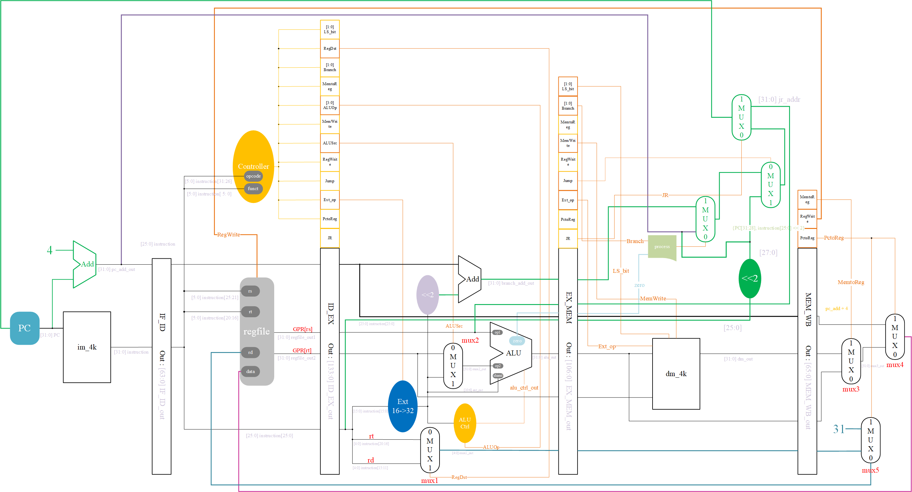

# 五级流水线（不带冒险和异常处理）

累死了。。。居然现在才开始记得记录日志。与其说是README，倒不如说是一个关于我从0开始研究组成设计与实现的日志。

### 项目结构

```
multistage_pipeline
	|-> Controller:  控制器
	|-> DataPath:    数据通路
	|-> data:		 IM和DM读入的地方
	|-> figure:      设计图纸
	|-> test_bench:  调教子模块的小黑屋
	|-> mips_code:   用来测试的mips汇编源代码
	|-> Python:		 一些加速生产的脚本，我高兴时可能会写写使用说明
	|-> mips.v:      最终的CPU
	|-> testBench:   测试mips.v的激励文件
	|-> README.md:   你知道的
	|-> .gitignore
```

### 设计图纸(2021.5.13更新)



更新：

- 取消了6号比较器
- 增加了判断JR的信号JR
- 为npc增加了一个比较器，用来区分JR与其他


---

## 日志

### 2021.5.13

今天修复了一个关于JR指令的bug，原本的设计我还有点自鸣得意——在EX处直接使用一个比较器将ID_EX_pc_add_out和ID_EX_regfile_out1选择一个，选择的依据是ID_EX_instr26的后六位，也就是funct码是否为JR的funct码001000，是的话选择ID_EX_regfile_out1，它GPR[rs]，也就是JR要给PC的值，用它取代原本的pc_add_out，就可以改变PC了。但是这么做有一个致命的问题：如果输入的指令是I型指令，且其immediate位的数字正好是001000，那么PC就会被误改。


