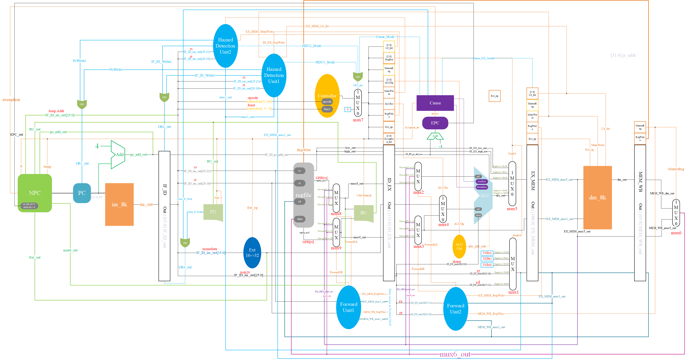

# 五级流水线（带冒险和异常处理）

### 项目结构

```
multistage_pipeline
	|-> data:		 	IM和DM读入的地方
	|-> figure:      	设计图纸，我高兴时可能会写写使用说明
	|-> Python:		 	一些加速生产的脚本
	|-> mips_code:   	用来测试的mips汇编源代码
	|-> sim:		    放激励文件的文件夹
	|-> src
		|-> Controller: 控制器
		|-> DataPath:   数据通路
		|-> Hazard:		旁路模块与冒险检测模块
		|-> Pipe:		流水线寄存器
		|-> Utils:		其余组件
		|-> myCpu.v:	顶层模块
	
	|-> README.md:   	Current 
	|-> .gitignore		上传文件过滤列表
```

### 设计图纸(2021.5.17更新)




---

## 日志

### 2021.5.17

从前两次的设计中，体会到一点：一个正确的，完备的思路对于一个不小的项目来说是多么的重要。因此，这次为了轻松愉悦的开发过程，我花了许久（6个小时左右）设计了最终带转发，冒险和异常检测的五级流水线图纸。并且吸取了部分DUAN学长的FPGA项目习惯。

祝成功！


### 2021.5.18

在实现乘除法指令(`MULT,DIV,MULTU,DIVU`)时，我发现了一个问题，那就是乘除法指令的输出是一个63位的数字，虽然实际上乘除法只是改变专用寄存器的值，但是我对专用寄存器的设计使得我每个时钟周期只能改变`$hi`和`$lo`中的某一个。我的电路无法在一个时钟周期内一次性改变`$hi`和`$lo`。总得满足我的乘除法指令吧？怎么办呢？我的做法比较简单粗暴，我为`ALU`增加了一个输出接口`prod`，这个接口值和MIPS32指令手册上描述乘法除法中的prod的含义一样，为了让它能够成功抵达`regfile`，并成功写入，我做出了如下的改变：

- `ALU`增加新的输出接口值`prod`，当然，相应的后续流水线寄存器中也会添加暂存prod的接口。
- 选择目的操作数寄存器编号的`mux1`增加一个选项：34，不同于0-33，34不代表任何一个寄存器的编号，而是告诉我们的regfile，你要拆分并读入流水线存入的prod值。
- `regfile`增加一个输入接口`MEM_WB_prod`，代表接受最后一个流水线寄存器的存储的prod值。然后在`regfile`内部，我增加了写寄存器的逻辑：增加一个34号，如果接受到的目的操作数编号（在我的设计中为`MEM_WB_mux1_out`）为34，则将prod拆成两块送给`$hi`和`$lo`。

> 是否有更好的解决方案呢？

### 2021.5.26

果然，在实现57条指令的过程中，我发现了一个问题，由于我对专用寄存器`$hi`和`$lo`的是走的专线，所以导致这两个家伙没有进入我的数据冒险系统中。也就是说，如果我的上一条指令改变了专用寄存器的值，而下一条指令又需要使用专用寄存器的值，那么就会发生错误，因为此时下一条指令拿到的`$hi`或者`$lo`并不是最新的。为了解决这个问题，我采用了简单粗暴的方法：为EX阶段的保存专用寄存器的线(`ID_EX_low_out`和`ID_EX_high_out`)增加旁路。需要注意的是，我的垃圾设计的缺点这个时候就体现出来了，因为存储最新的专用寄存器值得地方可以是专用寄存器专用线，也可以是prod，所以嘛。。。在写旁路时旁路单元输出旁路信号的逻辑会有一点点小的改变，旁路选择的选项也从原本的3个（EX_MEM阶段的源操作数值、MEM_WB阶段的源操作数值、原本的值，也就是ID_EX阶段源操作数的值）变为5个（增加了EX_MEM阶段的prod和MEM_WB阶段的prod），因此旁路单元输出的旁路信号的位数从原本的2位变成3位。


### 2021.5.26

中间事情真的很多，所以只能断断续续地更新了。在我的想法下，今天完成了57条指令的全数据通路和控制器的连接，接下来就只剩调试了。有时间我得将已经被我改得面目全非的设计图纸的visio原文件修改同步更新一下了。

### 2021.5.30

开始进行整体测试，今天先测试所有的R型指令，遇到了pc启动的问题，我将reset设置为了上升沿，并且将`pc.v`修改如下：

```verilog
    // initial 
    always @(posedge reset) begin
        pc_out <= initial_addr;
    end

    always @(posedge clock && reset == 1) begin
        if (!OR1_out)              // OR1_out represents stall or not
            pc_out <= npc_out;
    end
```

也就是将初始化和持续更新分开来。

除此之外，用来用来软堵塞pc的`OR1_out`和`OR2_out`一开始都是x，会使得pc在启动时不更新，所以需要对两个冒险模块初始化其输出信号，使得一开始输出的都是不堵塞的信号。

### 2021.5.31

5月的最后一天，我已经完成了所有R型指令的测试、旁路测试和冒险测试。debug过程中发现一个问题：和之前一样，尽量别写形如`posedge clock or posedge reset`，请把初始化的always块另外写，因为我这边默认是reset上升沿触发模块的初始化操作，但是如果你将reset信号与别的信号混在一起写，就会导致模块永远处于更新状态，对于我的`regfile`，这意味着，每当后续的上升沿来临时，寄存器堆中所有的寄存器都会清零。

**第二个值得记载的bug**就是有关branch类型指令的问题，在pro1和pro2中的branch信号中，我最终的目标地址是通过branch当前的相对位移`>>2`和基地址相加得到的，但是pro3在我的设计中，branch在ID阶段得到的`pc_add_out`是当前IF阶段的`pc_add_out`，而不是随着当前这条branch指令得到的。因此在使用branch跳转时使用的`pc_add_out`必须减四才能正确。

**第三个值得记载的bug**

对于跳转指令的堵塞，有一个很隐蔽的bug，在控制冒险时，当我们为了branch指令的操作数而软阻塞ID阶段和IF阶段的指令时，由于使用的是延迟槽的机制，虽然我们阻塞了ID和IF，但是判断是否冲刷的模块还是在正常工作。所以如果堵塞的branch指令是生效，是需要跳转的，那么在堵塞的第一个周期，IF_ID流水线寄存器中保存的ID阶段的指令就会被冲刷成空指令，这会使得第二个堵塞周期结束，电路回归正常时，branch会去解析空指令，从而使得pc变成0（这根据你提供的空指令的后16位决定，我使用的是`addi $t0, $zero, 0`，其后16位为0）.所以有必要控制堵塞IF_ID流水线寄存器的信号和冲刷IF_ID流水线寄存器的信号的优先级：**当且仅当IF_ID流水线寄存器不被堵塞时，IF_ID才能执行冲刷的操作**。根据这样的认识，我们可以只修改代码逻辑而不添加额外的信号得修复这个bug：

```verilog
    always @(posedge clock) 
    begin
        if (OR4_out)
            IF_ID_im_out = NOP;         // use NOP to flush and the pc_add_out won't be used later, so we don't care about pc_add_out there
        
        else if (!OR2_out)               // update iff IF_ID_Write
        begin
            IF_ID_im_out = im_out;
            IF_ID_pc_add_out = pc_add_out;
        end
    end
```

更改之后

```verilog
    always @(posedge clock) 
    begin
        if (!OR2_out)                // update iff IF_ID_Write
        begin
            if (OR4_out)
                IF_ID_im_out = NOP;  // use NOP to flush and the pc_add_out won't be used later, so we don't care about pc_add_out there
            else
                IF_ID_im_out = im_out;
            IF_ID_pc_add_out = pc_add_out;
        end
    end
```