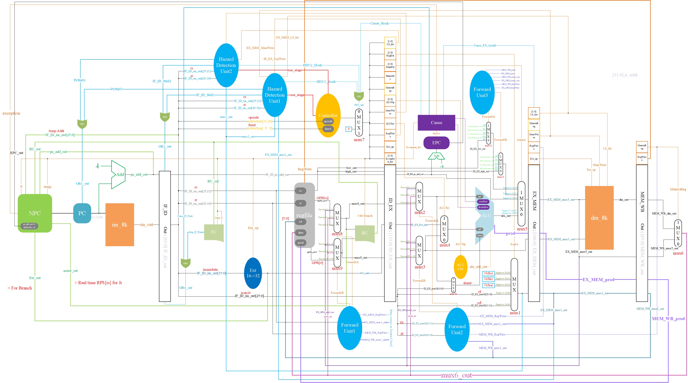

# 五级流水线（带冒险和异常处理）

### 项目结构

```
multistage_pipeline
	|-> data:		 	IM和DM读入的地方
	|-> figure:      	设计图纸，我高兴时可能会写写使用说明
	|-> Python:		 	一些加速生产的脚本
	|-> mips_code:   	用来测试的mips汇编源代码
	|-> sim:		 	放激励文件的文件夹
	|-> src
		|-> Controller: 控制器
		|-> DataPath:   数据通路
		|-> Hazard:		旁路模块与冒险检测模块
		|-> Pipe:		流水线寄存器
		|-> Utils:		其余组件
		|-> myCpu.v:	顶层模块
	
	|-> README.md:   	Current 
	|-> .gitignore		上传文件过滤列表
```

### 设计图纸(2021.5.17更新)




---

## 日志

### 2021.5.17

从前两次的设计中，体会到一点：一个正确的，完备的思路对于一个不小的项目来说是多么的重要。因此，这次为了轻松愉悦的开发过程，我花了许久（6个小时左右）设计了最终带转发，冒险和异常检测的五级流水线图纸。并且吸取了部分DUAN学长的FPGA项目习惯。

祝成功！


### 2021.5.18

在实现乘除法指令(`MULT,DIV,MULTU,DIVU`)时，我发现了一个问题，那就是乘除法指令的输出是一个63位的数字，虽然实际上乘除法只是改变专用寄存器的值，但是我对专用寄存器的设计使得我每个时钟周期只能改变`$hi`和`$lo`中的某一个。我的电路无法在一个时钟周期内一次性改变`$hi`和`$lo`。总得满足我的乘除法指令吧？怎么办呢？我的做法比较简单粗暴，我为`ALU`增加了一个输出接口`prod`，这个接口值和MIPS32指令手册上描述乘法除法中的prod的含义一样，为了让它能够成功抵达`regfile`，并成功写入，我做出了如下的改变：

- `ALU`增加新的输出接口值`prod`，当然，相应的后续流水线寄存器中也会添加暂存prod的接口。
- 选择目的操作数寄存器编号的`mux1`增加一个选项：34，不同于0-33，34不代表任何一个寄存器的编号，而是告诉我们的regfile，你要拆分并读入流水线存入的prod值。
- `regfile`增加一个输入接口`MEM_WB_prod`，代表接受最后一个流水线寄存器的存储的prod值。然后在`regfile`内部，我增加了写寄存器的逻辑：增加一个34号，如果接受到的目的操作数编号（在我的设计中为`MEM_WB_mux1_out`）为34，则将prod拆成两块送给`$hi`和`$lo`。

> 是否有更好的解决方案呢？

### 2021.5.26

果然，在实现57条指令的过程中，我发现了一个问题，由于我对专用寄存器`$hi`和`$lo`的是走的专线，所以导致这两个家伙没有进入我的数据冒险系统中。也就是说，如果我的上一条指令改变了专用寄存器的值，而下一条指令又需要使用专用寄存器的值，那么就会发生错误，因为此时下一条指令拿到的`$hi`或者`$lo`并不是最新的。为了解决这个问题，我采用了简单粗暴的方法：为EX阶段的保存专用寄存器的线(`ID_EX_low_out`和`ID_EX_high_out`)增加旁路。需要注意的是，我的垃圾设计的缺点这个时候就体现出来了，因为存储最新的专用寄存器值得地方可以是专用寄存器专用线，也可以是prod，所以嘛。。。在写旁路时旁路单元输出旁路信号的逻辑会有一点点小的改变，旁路选择的选项也从原本的3个（EX_MEM阶段的源操作数值、MEM_WB阶段的源操作数值、原本的值，也就是ID_EX阶段源操作数的值）变为5个（增加了EX_MEM阶段的prod和MEM_WB阶段的prod），因此旁路单元输出的旁路信号的位数从原本的2位变成3位。


### 2021.5.26

中间事情真的很多，所以只能断断续续地更新了。在我的想法下，今天完成了57条指令的全数据通路和控制器的连接，接下来就只剩调试了。有时间我得将已经被我改得面目全非的设计图纸的visio原文件修改同步更新一下了。

